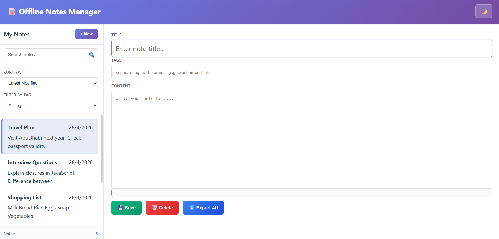
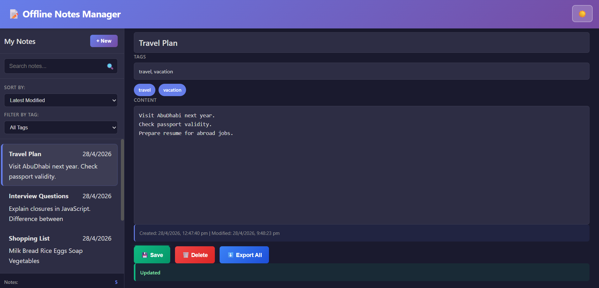

# Offline Notes Manager
An offline-first notes application built using Vanilla JavaScript and IndexedDB.  
This project was developed as part of an interview coding assessment for the Trainee Engineer role.

This solution demonstrates advanced frontend development practices including offline data persistence, advanced database indexing, responsive UI/UX, and code architecture best practices.

The goal of the application is to allow users to create, edit, search, sort, delete, and export notes directly in the browser without depending on any backend or internet connection.

### Core Features
1.CREATE & EDIT NOTES
- Create new notes with title, content, and tags
- Edit existing notes with automatic field preservation
- Full form validation and error handling

2.LOCAL STORAGE (MANDATORY - IndexedDB)
- Uses IndexedDB exclusively for data persistence
- Proper schema design with multiple indexes for query optimization
- Support for 5 indexes: title, tags, content, createdAt, updatedAt, isDeleted
- No localStorage/sessionStorage used for main data (only preferences)

3.SEARCH & FILTER
- Real-time search across title, content, and tags
- Dynamic tag-based filtering
- Results update instantly as you type
- Efficient query execution using indexes

4.SORTING
- Sort by created date (ascending/descending)
- Sort by last modified (ascending/descending)
- Persistent sorting preference

5.DELETE NOTES
- Soft delete implementation (marks as deleted, preserves data)
- Hard delete capability
- Confirmation dialog for user safety

6.RESPONSIVE UI/UX
- Professional sidebar with note list
- Full-featured editor panel
- Responsive design (desktop, tablet, mobile)
- Clean, modern interface

### Additional Features
7. Dark mode toggle
8. Export all notes as JSON
9. Responsive layout for desktop and mobile
10. Works completely offline

## Technologies Used
- HTML5
- CSS3
- JavaScript (Vanilla JS)
- IndexedDB

## Database Used
This project uses **IndexedDB** for storing notes locally in the browser.

### Database Name:
OfflineNotesDB

### Object Store:
notes

### Fields Stored:
- id
- title
- content
- tags
- createdAt
- updatedAt
- isDeleted

### Indexes Created:
- title
- tags
- content
- createdAt
- updatedAt
- isDeleted
IndexedDB was chosen because it supports larger storage, structured data, and works asynchronously.

## 📈 Performance Metrics

### Load Performance
- First Contentful Paint: < 500ms
- Interactive: < 1s
- No external dependencies (pure vanilla JS)

### Runtime Performance
- Search: < 50ms for 1000 notes
- Sort: < 100ms for 1000 notes
- Save: < 200ms
- Auto-save doesn't block UI (debounced)

#### File Organization
offline-notes-manager/
├── index.html          # Semantic HTML structure
├── script.js           # 500+ lines of organized JavaScript
├── style.css           # Comprehensive styling with dark mode
└── README.md           # This documentation
└──screenshots/
   ├── dashboard.png
   └── darkmode.png          

#### Code Organization in script.js

1. DATABASE INITIALIZATION & SCHEMA
   - Config object
   - onupgradeneeded handler
   - Error handling

2. DOM ELEMENTS & STATE
   - Centralized DOM references
   - Organized by functionality

3. INITIALIZATION 
   - Single entry point
   - Event listener attachment

4. CRUD OPERATIONS
   - CREATE, READ, UPDATE, DELETE
   - Separated by operation type
   - Clear function responsibilities

5. AUTO-SAVE FUNCTIONALITY
   - Debounced saves
   - Prevents excessive writes

6. SEARCH & FILTERING
   - Tag filtering
   - Tag parsing
   - Multi-field search

7. EXPORT FUNCTIONALITY
   - JSON formatting
   - Metadata inclusion

8. DARK MODE
   - Theme toggle
   - Preference persistence

9. UI HELPERS 
   - Reusable utilities
   - HTML escaping for security
   - Date formatting

## Security Considerations
### XSS Prevention
javascript
// escapeHtml() function prevents XSS attacks
// All user input is escaped before rendering
noteCard.innerHTML = `<h4>${escapeHtml(note.title)}</h4>`;

### Data Integrity
- Transactions ensure atomic operations
- No eval() or unsafe DOM manipulation
- Input validation on form submission

### Privacy
- All data stored locally (no server transmission)
- Dark mode preference only sent to localStorage
- No analytics or tracking code

## Screenshots
### Main Dashboard

### Dark Mode View

## Project Structure
offline-notes-manager/
│── index.html
│── style.css
│── script.js
│── README.md
│──screenshots/
   ├── dashboard.png
   └── darkmode.png

  

## Notes
This project was built as part of an interview coding assessment and focuses on clean UI, offline data storage, and practical frontend development using Vanilla JavaScript.
